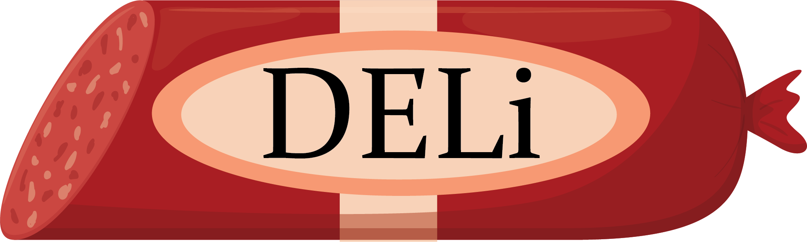

# DELi


DELi (DNA-Encoded Library informatics) is a Python library for working with DELs.
It incorporates the whole pipeline post base-calling/sequencing including:
1. Barcode/DEL ID calling and cube file generation
2. Enumeration of chemical structures from building blocks
3. Disython and Monosynthon analysis
4. Generation of machine learning datasets and baseline models from DEL data
5. Various digestible reports to understand the DEL results

You can read the detailed documentation [here](https://dna-encoded-library-informatics-deli.readthedocs.io/en/latest/).

## Installing DELi
You can install DELi using pip on Python 3.13 or newer:

```shell
pip install deli-chem
```

Optional graph neural network (GNN) analysis dependencies:

```shell
pip install 'deli-chem[ml]'
```

## Getting Started

You can use DELi as a command line tool (see the [docs](https://dna-encoded-library-informatics-deli.readthedocs.io/en/latest/cli_docs.html) for more details) or as a python package
```python
import deli
print(deli.__version__)
```
> [!NOTE]
> installing DELi uses `deli-chem` but to use DELi after install make sure to use `deli` and that you have no other packages named `deli`

For an end-to-end workflow of running DELi with open source libraries and selections (Enumerate, Decode, Analyze), see the [examples documentation](examples/README.md).

## Why not a compiled language
DELi is written in Python for two reasons:
1. We wrote the first versions of it in Python
2. Python is the language most scientists in our field know, so it makes contributions from other DEL experts easier

It is true that DELi would be faster as a compiled C++ or Rust program, but we have optimized the DELi enough that runtime isn't much of an issue.
We hope to someday write a Rust version of DELi (at least for decoding and enumeration) but those plans are not yet in motion.

**Note for developers:** DELi uses `uv` for builds and dependency management. After cloning the repo, install with `pip install -e .` or `uv sync`. See [Testing and coverage](https://dna-encoded-library-informatics-deli.readthedocs.io/en/latest/development_docs/testing.html) for current test coverage.

## Test coverage

Automated tests (`pytest`, 199 tests) cover **77.5%** of the `deli` source (statement coverage via `coverage.py`, DELi 0.2.1). Highest coverage is in decoding and DEL object modules (>80%); analysis modules are at **74%** overall.

| Module | Coverage |
|--------|----------|
| `deli.dna` | 97.0% |
| `deli.dels` | 85.2% |
| `deli.decode` | 82.2% |
| `deli.enumeration` | 80.7% |
| `deli.analysis` | 73.6% |
| `deli` (CLI, configure) | 68.8% |
| `deli.utils` | 72.6% |

Full tables, per-file analysis breakdown, and commands to regenerate: [Testing and coverage docs](https://dna-encoded-library-informatics-deli.readthedocs.io/en/latest/development_docs/testing.html).

## Citation

If you use DELi in your research, please cite our paper:

> Wellnitz J, Novy B, Maxfield T, Lin S-H, Zhilinskaya I, Axtman M, Leisner T, Merten E, Norris-Drouin JL, Hardy BP, Pearce KH, Popov KI. (2025). *Open-Source DNA-Encoded Library informatics Package for Design, Decoding, and Analysis: DELi*. bioRxiv. https://doi.org/10.1101/2025.02.25.640184
