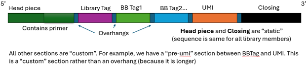

.. _deli-glossary-ref:

=============
DELi Glossary
=============
There are a handful of "jargony" terms that are used throughout the DEL
literature and thus, DELi's documentation.
Sadly, these terms are not very standardized.
To avoid confusion, here we have provided a glossary of some of the common
terms used in DEL/DELi and how we have defined them.
When understanding what a term means *in DELi*, refer only to this glossary,
not to other textbooks, literature or colleagues. There is a chance DELi
uses a term differently then you might be used to.

.. _deli-terminology-ref:

Glossary
========

DNA Barcode
-----------
The full DNA tag/sequence that is attached to a given compound

DNA Barcode Schema
------------------
The template for a given DNA Barcode;
some nucleotides will be abstracted as “N” since they will vary
from barcode to barcode. All DELs have a single barcode schema

Barcode Section
---------------
A specific subregion ("section") of a barcode. For example, the "Library Tag" is a barcode section

Static Section
--------------
A barcode section that will have the same sequence for all barcodes/compounds in a library.
For example, the Head Piece section of a barcode is static.
While in literature, we might think of the Library Tag as a static section,
in DELi, it is static, as every barcode *in a give library* shares the same library tag.

Variable Section
----------------
A barcode section that will have a different sequence for each barcode/compound in a library.
The building block section of a barcode are variable

HeadPiece
---------
The section of the DNA barcode that attaches the DNA to the linker/compound.
This generally will also include the Opening Primer and is static

Overhang
--------
These are short (2-3 basepairs) and static regions of the barcode that directly follow a given section.
They are used to aid in DNA ligation during library synthesis.
Even variable regions can have overhangs.

Closing
-------
This is the section of the DNA that holds the end of the DNA barcode. This region is usually static and contains the Closing Primer.

UMI
---
Stands for Unique Molecular Identifier.
This is a barcode section that contains random nucleotides for each *individual* molecule in a library.
This is used to help with qPCR and noise reduction.

DEL/DELibrary
---
Stands for DNA-Encoded Library. Unlike it is often used in other settings, in DELi, a DEL refers to a **single**
library generated from a single synthesis. This means everything in the library should have the same head piece and library tag.

DEL/DELibrary Collection
------------------------
A "collection" of DELs is the term DELi uses to represent several DELs (with different library tags) that have been mixed to together.
It is common to screen with DEL this way, and it is often called a "DEL Screening". Just know that in DELi terms, we would call that a
"DEL Collection Screening", since it was more than one DEL.

Building Block/BB
-----------------
The chemical "building blocks" (think fragments) that are used to create a full DEL compound, following some static reaction scheme.
These are the bread and butter of combinatorial chemistry.

Cycle
-----
These are the reaction/steps that add building blocks one by one to the compound. In DELi they always start at "1" and increase
by 1 for each cycle. So if DEL is built such that each compound is made of 3 building blocks, it is a "3 cycle library", and the
the cycles will be named 1,2,3. To seperate different building blocks in different cycles, DELi also calls the building blocks
used in the first cycle "BB1". This is also the name of the barcode section that encodes for that building block.

Selection
---------
DELi uses the term "selection" to refer to the process of screening a DEL library for a specific target. This is often done using
a "selection" or "panning" step, where the library is incubated with the target and only the compounds that bind are retained.
Selections are only for a single condition. DELi operates at the Selection level, processing counts per selection.
This is slightly different from how it is sometimes used in literature, where a selection might refer to a merged results of
several separate selection conditions. In DELi, we call that a "Scenario" (see below).

Decoding
--------
After a Selection, the DNA tags are amplified and sequence resulting in a large FASTQ file of sequences reads.
These need to be "decoded" back in the DEL compound IDs so the chemicals (and their counts) can be determined.
Decoding specifically refers to converting a single read into a single DEL compound.

UMI Correction
--------------
This is sometimes called "Degeneration" in literature and other DEL providers.
This is the process of accounting for noise induced during PCR amplification by "correcting" counts for duplicate UMIs.
This way we are not counting reads, but rather unique molecules.

Raw Count
---------
In DELi the raw count is the *number of sequences* that had got decoded to a given compound ID. Note this number can
be inflated as it includes possible excess amplification caused by PCR, and may not be well correlated with predicted binding

UMI Corrected Count
-------------------
This is the count after UMI correction. This is the number of unique molecules that were decoded to a given compound ID,
rather then raw sequence reads. This is the number that should be used for downstream analysis. It is only possible
to get if your library barcode schema has a UMI section.

Enrichment
----------
This refers to using the collected count info and some kind of statistical analysis to determine if a given compound
was enriched compared to the expected value (whatever that may be)

NTC/No Target Control
---------------------
A NTC is a special selection that is used to determine the background noise for a set of selections. In this case,
the same buffers and experimental set is done (ideally on the same day by the same person and the same equipment)
but with no target protein is used. This is often used to rule out "background binder" or things that might just
enrich because of the other moving parts in the selection and not the target of interest itself.

Scenario
--------
This refers to aggregating multiple selections enrichment/count results together to form a new single enrichment or
binary label to a compound. For example, say you did 3 selections, one with the target, one NTC and one with a known
inhibitor. A scenario could be looking for compounds that bind the same site as the known inhibitor. In this case we
are looking for things enriched in the first target selection, but not the other 2. Or it could be looking for
"allosteric" binders that have a novel binding site. This would be compounds enriched in the two targets selection
(with and without inhibitor) but not the NTC.

DELi separate Selection and Scenarios this way to help with lightweight and flexible analysis. Globbing it all together
can make new scenarios require reindent processing if individual selection results are not saved. This is why the
decoding module of DELi operates at the Selection level, and not the Scenario level. The Analysis module is used to
generate scenario results.
